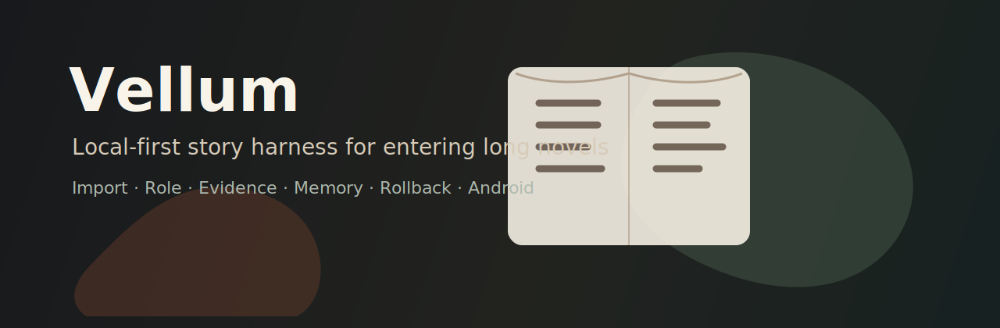

# Vellum

<p align="center">
  
</p>

<p align="center">
  <strong>本地优先的穿书 Harness：把百万字小说变成可进入、可回滚、可追溯依据的游玩线程。</strong>
</p>

<p align="center">
  <a href="../README.md">English</a>
  ·
  <a href="README.zh-CN.md">简体中文</a>
  ·
  <a href="README.ja.md">日本語</a>
  ·
  <a href="README.ko.md">한국어</a>
</p>

Vellum 面向“穿书”场景：导入长篇小说，选择你的身份，进入当前场景，然后说话、行动、继续剧情、查看原文依据，或者在剧情走偏时回滚。

它不是把整本书塞进一个聊天框。Vellum 采用类似 Codex 的 harness 架构：每一回合都是可恢复的任务线程，会检索原文、组装必要上下文、生成场景、做连续性检查、更新记忆、记录依据，并提交为一个 `StoryTurn`。

## 下载

Android Alpha 版会发布在 [GitHub Releases](https://github.com/wimi321/vellum/releases/latest)。

- `Vellum-0.1.0-android-universal.apk`：可侧载安装的 Android 安装包。
- `Vellum-0.1.0-android-universal.aab`：面向商店验证的 Android App Bundle。
- `Vellum-0.1.0-checksums.txt`：release 文件的 SHA-256 校验。

当前版本仍是早期 Alpha，适合验证产品方向、导入能力和 Harness 流程。生产级模型调用、密钥安全存储、稳定签名和自动更新通道仍在路线图中。

## 核心思路

| 原则 | 含义 |
| --- | --- |
| 本地优先 | 书籍、分片、索引、游玩记录、依据、trace 都保存在本机。 |
| 百万字友好 | 导入时流式分章分片，不把整本书一次性发给模型。 |
| 原文依据 | 每次生成的场景都可以追溯到参与生成的原文片段。 |
| Harness 而不是聊天拼接 | 回合是带工具调用、trace、回滚、记忆和连续性检查的状态任务。 |
| 傻瓜式体验 | 普通玩家只需要“导入小说 -> 选择身份 -> 开始穿书 -> 说话 / 行动 / 继续”。 |
| 桌面和 Android 一等支持 | 同一个 Tauri 2 项目输出桌面端和 Android 端。 |

## 用户流程

1. 导入 `.txt`、`.md`、无 DRM `.epub` 或章节文件夹。
2. Vellum 流式读取文本，切分章节和分片，建立本地检索元数据。
3. 选择身份：姓名、角色、目标。
4. 开始一个穿书会话。
5. 使用三个核心操作：
   - **说一句**：与角色对话。
   - **做动作**：在场景里行动。
   - **继续剧情**：让故事自然推进。
6. 查看原文依据、记忆、时间线和可选的 Harness trace。
7. 剧情跑偏时回滚上一回合。

## 架构

```text
crates/
  story-store/          SQLite、导入任务、分片、检索、会话、依据、trace
  story-harness-core/   StoryTurn 循环、工具编排、记忆、回滚
  model-adapters/       BYOK 模型配置和模型客户端边界

apps/
  story-tauri/          Tauri 2 + React 桌面端和 Android 端
```

### 回合循环

```text
PlayerAction
  -> retrieve_context
  -> draft_scene
  -> continuity_check
  -> update_memory
  -> commit_turn
```

普通用户看到的是“正在查原文 / 正在续写 / 已保存”。高级 trace 默认折叠，只在需要时展示。

## 隐私

Vellum 的设计规则是：**永远不要上传整本书**。

书籍、分片、搜索索引、会话、证据、记忆、时间线和 provider profile 都保存在本机。未来启用远程模型供应商时，只发送当前回合所需的少量检索片段到用户自己配置的 BYOK 供应商。

## 快速开始

```bash
npm install
npm test
cargo test --workspace
npm run tauri:build
npm run android:build
```

Android release 默认输出 unsigned APK。需要可安装 APK 时，使用本地 keystore 执行：

```bash
VELLUM_ANDROID_KEYSTORE="$HOME/.android/vellum-release.jks" \
VELLUM_ANDROID_KEYSTORE_PASSWORD="..." \
VELLUM_ANDROID_KEY_PASSWORD="..." \
scripts/sign-android-apk.sh
```

## 已验证

- Rust 单元测试：导入、检索、持久化、回滚、200 万中文字符 scale import。
- Harness 测试：`import -> start -> action -> retrieve -> scene -> memory -> resume`。
- Vitest：首轮用户流程和界面文案保护。
- Web production build。
- macOS Tauri bundle build。
- Android universal APK / AAB build。
- `aapt dump badging` 元数据检查。
- `apksigner verify` 安装包签名检查。

Android 模拟器运行级 smoke 仍单独跟踪，因为当前开发机器没有可用的 emulator binary 或连接设备。

## 许可证

Apache-2.0。见 [LICENSE](../LICENSE) 和 [NOTICE](../NOTICE)。
